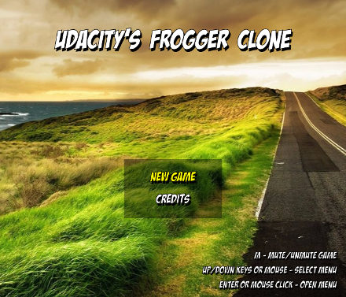
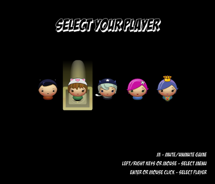
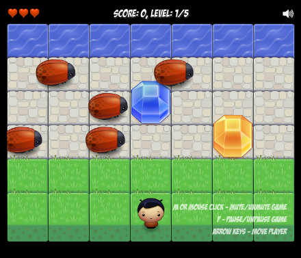
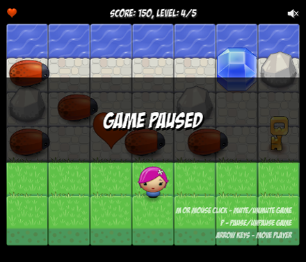
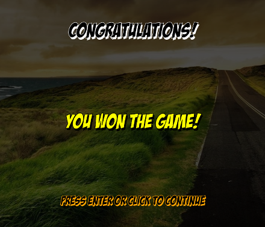
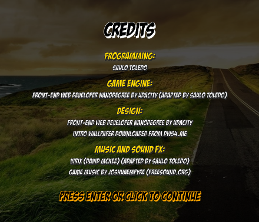

# Udacity Classic Arcade Game Clone

This is a 2D frogger like game build on top of HTML canvas. In this game the player should reach the water, avoiding bugs. Every time it reaches its goal, the player goes to the next level, where there are new and faster enemies and some rocks blocking the path. The player can also collect some elements, like diamonds, stars, keys and extra lifes, in order to increase his game score. The game is won when the player finishes all game levels.

## Game Preview

### **Play it online [here](https://saulotoledo.github.io/classic-arcade-game-clone/)!**








## Libraries and development

Although not necessary, this implementation uses [RequireJS](http://requirejs.org/) to improve code readability. [RequireJS](http://requirejs.org/) is an [AMD module loader](http://requirejs.org/docs/whyamd.html), and it helps to visualize the dependencies between the entities in our code. For the sake of simplicity, there is a [copy of version 2.3.3](js/libs/require.js) of the library in the repository. With the proper changes, the game can still run without it.

## Running the Game

This game is fully implemented in client-side JavaScript, so you just need a browser with HTML5 support. In order to run this game, one can follow the steps below:

1. Clone project:

    ```
    $ git clone https://github.com/saulotoledo/classic-arcade-game-clone.git
    ```

2. Open the file `index.html` in your preferred browser.

## Game Controls

### Global commands
- **M key**: Mute/unmute game.

### Intro page
- **Mouse move or up/down arrow keys (&#8593; &#8595;)**: Select menu item;
- **Mouse left click or Enter key**: Use menu item;

### Select your player page
- **Mouse move or left/right arrow keys (&#8592; &#8594;)**: Select character;
- **Mouse left click or Enter key**: Choose character;

### Game page
- **Arrow keys (&#8592; &#8593; &#8594; &#8595;)**: Move the player;
- **Mouse click on sound icon or M key**: Mute/unmute game.
- **P key**: Pause/unpause game.

### Credits page/Finished game pages
- **Mouse left click or Enter key**: Go to intro screen.

## Copyright information

- **Source code (except `require.js`, `engine.js` and `resources.js`)**: [MIT License](LICENSE.md) - Copyright (c) 2017 Saulo S. Toledo;
- **`require.js`**: Check in [their website](http://requirejs.org/) or [here](https://github.com/requirejs/requirejs/blob/master/LICENSE);
- **Game assets, `engine.js` and `resources.js`**: Please check each author's distribution license.
